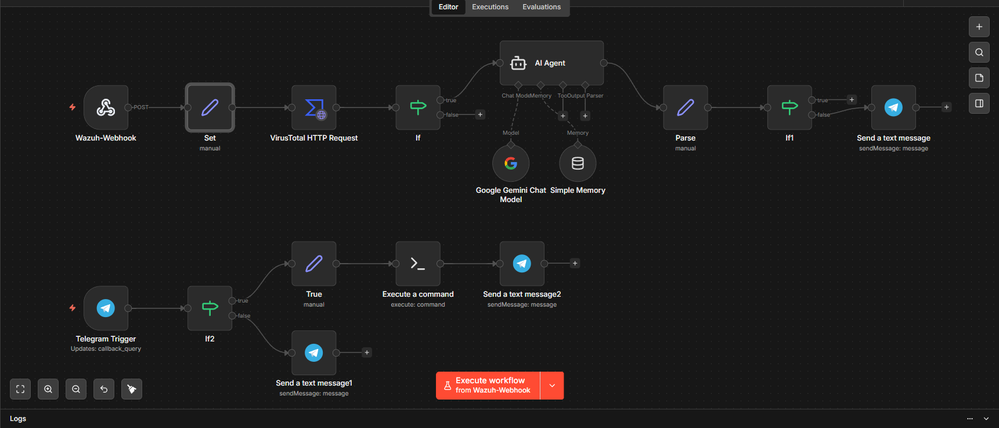
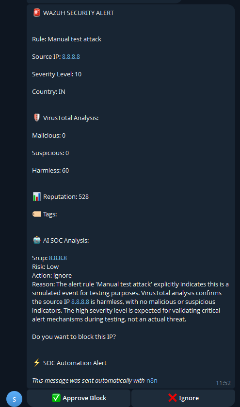
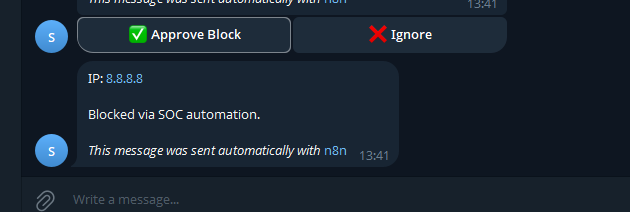
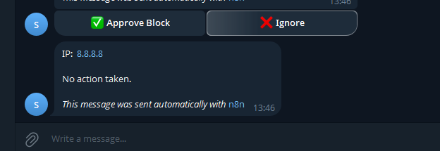
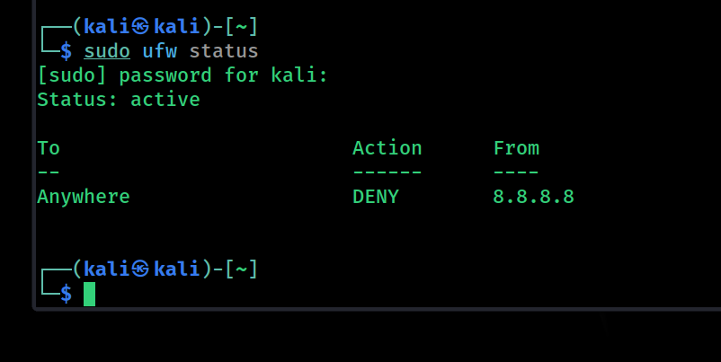

🚨 AI SOC Automation (Wazuh + VirusTotal + Gemini + n8n)

This project demonstrates an AI-driven Security Operations Center (SOC) automation pipeline that ingests alerts from Wazuh, enriches them with threat intelligence, analyzes them using AI, and enables real-time response through Telegram.

The system integrates SIEM, Threat Intelligence, AI analysis, and SOAR-like automation to simulate a real-world SOC workflow.

🔄 Workflow

Wazuh sends security alerts via webhook

Extract alert details (rule, IP, severity)

Enrich IP using VirusTotal API

Analyze risk using AI (Google Gemini)

Decision logic:

If low risk → ignore

If high risk → notify analyst

Send alert to Telegram with action buttons

Analyst chooses:

✅ Approve Block → block IP using UFW via SSH

❌ Ignore → no action taken

🐍 Wazuh → n8n Alert Forwarding Script

A Python script is used to simulate or forward Wazuh alerts to the n8n webhook.

📄 View the script here:
👉 [send_alert.py](send_alert.py)

 📌 What it does:

* Sends alert data (rule, source IP, severity) to n8n
* Triggers the SOC automation workflow
* Useful for testing and simulation

 ▶️ Usage

pip install requests

python3 scripts/send_alert.py

📸 Screenshots

⚙️ Architecture

🚨 Alert with AI Analysis

✅ Block Action

❌ Ignore Action

🔐 Firewall Enforcement

🧠 Features

🔍 Real-time alert ingestion from Wazuh (SIEM)

🌐 Threat intelligence enrichment via VirusTotal API

🤖 AI-based risk analysis using Google Gemini

⚡ Automated decision-making workflow (n8n)

👨‍💻 Human-in-the-loop approval via Telegram

🔐 Automated IP blocking using UFW (firewall)

🧩 Modular and extensible architecture

🛠️ Tech Stack

SIEM: Wazuh

Automation: n8n

AI Model: Google Gemini

Threat Intelligence: VirusTotal API

Messaging: Telegram Bot

Firewall: UFW (Linux)

Infrastructure: AWS (n8n) + VMware Kali Linux

🚀 Use Cases

SOC alert triaging automation

Threat enrichment and analysis

Incident response automation

Reducing manual workload in SOC environments
